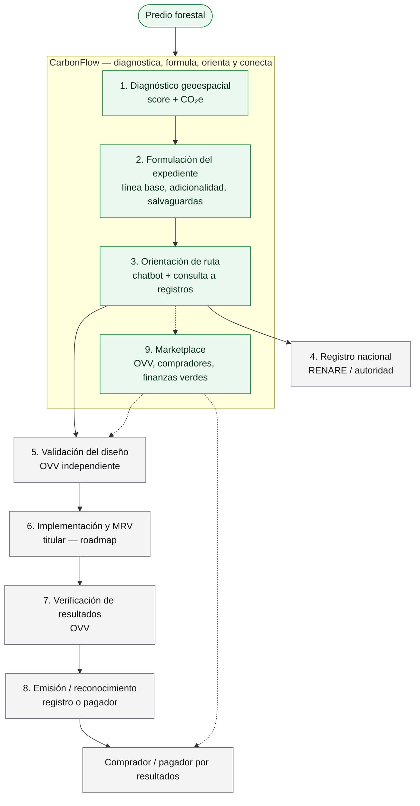

# CarbonFlow

**Hackathon CTW 2026 — Mercados de Bonos de Carbono**

###Abrir [(https://carbonflow-tau.vercel.app/).

Tener un bosque no alcanza para entrar al mercado de carbono. Falta saber si el predio sirve, cómo formular el proyecto, qué certificación aplica y con quién conectar. Eso hoy es lento, caro y está en manos de especialistas.

**CarbonFlow** es una plataforma web que acompaña a un propietario o desarrollador desde “tengo un predio forestal” hasta un diagnóstico, un expediente, orientación de certificación y un listado en marketplace — en un solo flujo, con datos en vivo.

CarbonFlow **no certifica, no verifica y no emite créditos**. Orienta, documenta y conecta.



Verde = lo que hace CarbonFlow. Gris = lo que hacen RENARE, la OVV, el titular en campo o el mercado. Las líneas punteadas son conexión comercial, no certificación.

### Cómo se pone en funcionamiento un proyecto de carbono — y qué hace CarbonFlow

Un crédito no nace del bosque: nace de un proceso. El titular (dueño del predio o desarrollador) tiene que demostrar que hay un proyecto real, que es adicional, que alguien independiente lo valida y verifica, y que un registro lo reconoce. CarbonFlow cubre el tramo que hoy más frena a un propietario pequeño: **antes** de contratar una OVV y **antes** de emitir nada.

| Paso | Quién lo hace | Papel de CarbonFlow |
|---|---|---|
| 1. Definir el predio y el objetivo | Titular | **Diagnóstico:** polígono, datos en vivo (bosque, deforestación, áreas protegidas), score de prefactibilidad y estimado de CO₂e. Responde: *¿vale la pena seguir?* |
| 2. Formular el proyecto | Titular | **Formulación:** expediente guiado (línea base, adicionalidad, riesgos, salvaguardas, cronograma, presupuesto). Organiza el PDD preliminar; no lo certifica. |
| 3. Elegir ruta y prepararse para registro | Titular, con orientación | **Validación / registro:** chatbot normativo + consulta a registros (RENARE, estándares, OVV). Explica el camino; **no registra** la iniciativa ante la autoridad. |
| 4. Registro nacional (cuando aplique) | **RENARE / autoridad** | CarbonFlow no sustituye a RENARE. Solo orienta y enlaza a la fuente oficial. |
| 5. Validación independiente del diseño | **OVV** (organismo acreditado) | CarbonFlow **no valida**. En el marketplace conecta con OVV para solicitar información. |
| 6. Implementar, monitorear y reportar (MRV) | Titular + evidencias de campo | **Fuera del hackathon** (roadmap). Sin esto no hay resultados verificables. |
| 7. Verificación de resultados | **OVV** | CarbonFlow **no verifica**. |
| 8. Reconocimiento / emisión de resultados | **Registro o pagador** (Verra, Gold Standard, RENARE, programa) | CarbonFlow **no emite** créditos ni bonos. |
| 9. Conectar oferta y demanda | Titular + comprador / financiador | **Marketplace:** catálogo de OVV, proyectos y finanzas verdes. Las solicitudes son reales; las respuestas de contraparte en el MVP son **simuladas**. |

En una línea: **el titular decide y opera, RENARE registra, la OVV valida y verifica, el mercado paga; CarbonFlow diagnostica, formula, orienta y conecta.**

---

## El problema (en una frase)

En Colombia hay mucho potencial forestal y muy poca digitalización del primer tramo: diagnosticar un predio, armar el proyecto y entender el camino a certificación.

## Qué construimos para el hackathon

Cuatro módulos encadenados. El diferenciador es el diagnóstico geoespacial con APIs reales.

| # | Módulo | Ruta | Qué es |
|---|---|---|---|
| 1 | Diagnóstico geoespacial | `/diagnostico` | Dibuja o carga un polígono → consulta GFW, RUNAP y Nominatim → score de prefactibilidad explicable + estimado de CO₂e + PDF |
| 2 | Formulación | `/formulacion` | Expediente guiado (línea base, adicionalidad, riesgos, salvaguardas, cronograma, presupuesto) a partir del predio ya diagnosticado |
| 3 | Validación / registro | `/validacion-registro` | Chatbot de orientación normativa + consulta de registros (RENARE / OVV / estándares) |
| 4 | Marketplace | `/marketplace` | Plaza de conexión: OVV, proyectos de carbono y finanzas verdes. Solicitudes reales; **respuestas de contraparte simuladas** |

Tipo de proyecto funcional: **conservación / restauración forestal**. El resto aparece como “próximamente”.

### Qué es real, qué es simulado, qué es visión

| Real | Simulado (a propósito) | Fuera de alcance (roadmap) |
|---|---|---|
| Diagnóstico con APIs en vivo, score, CO₂e, PDF | Respuestas de contraparte en marketplace / finanzas verdes | MRV operativo (evidencias, versionado, bitácora) |
| Formulación persistida en Supabase | — | Otros tipos de proyecto (solar, eólica, etc.) |
| Chatbot LLM + búsqueda / enlaces a registros | — | Pagos, custodia o transacción real de créditos |
| Auth anónima (sesión estable para RLS) | — | Login/signup tradicional y RBAC multi-org |

---

## Cómo funciona el diagnóstico (núcleo)

1. El usuario dibuja el predio en el mapa o sube GeoJSON.
2. El área se calcula en el cliente (Turf.js).
3. El servidor consulta, con caché / timeout / reintento:
   - **Global Forest Watch** — cobertura boscosa y presión de deforestación
   - **RUNAP** (Parques Nacionales, ArcGIS) — traslape con áreas protegidas
   - **Nominatim** — municipio / ubicación
4. Un **score 0–100** se arma como suma ponderada transparente (no es un modelo de ML):

| Factor | Peso |
|---|---|
| Cobertura boscosa | 30% |
| Deforestación (alertas) | 20% |
| Área protegida | 15% |
| Tamaño del predio | 15% |
| Completitud de la información | 20% |

El estimado de CO₂e usa un factor tipo IPCC Tier 1. Siempre se muestra como **estimación no certificada**, con fuente.

---

## Arquitectura

```
Navegador (Next.js 16 / React 19)
  ├── Mapa: Leaflet + OpenStreetMap (sin API key)
  ├── PDF: jsPDF en el cliente
  └── UI: Tailwind v4 + design system CarbonFlow
        │
        ▼  Route Handlers  src/app/api/*/route.ts
Servidor Next.js (sin backend aparte)
  ├── Integraciones con resiliencia (caché, timeout, fallback)
  ├── OpenRouter (Gemini 2.5 Flash) — chatbot y generación de PDD
  └── Supabase — Postgres + Auth anónima + Storage
```

La app vive en `carbonflow-app/`. Cada llamada a un servicio externo pasa por `src/lib/resilience.ts`: no hay `fetch` directo a APIs de terceros en las rutas.

**Datos:** `predios` → `diagnosticos` → `expedientes` → conversaciones / consultas / solicitudes de marketplace. Todo queda scoped al `owner_id` de la sesión anónima (RLS).

**Especificación de producto:** [`PRD_CarbonFlow.md`](./PRD_CarbonFlow.md)

---

## Cómo correrlo

```bash
cd carbonflow-app
npm install
cp .env.local.example .env.local   # completar claves
npm run dev
```

Abrir [(https://carbonflow-tau.vercel.app/).

### Variables de entorno

Ver `carbonflow-app/.env.local.example`.

| Variable | Para qué |
|---|---|
| `NEXT_PUBLIC_SUPABASE_URL` / `NEXT_PUBLIC_SUPABASE_ANON_KEY` | Persistencia y RLS |
| `SUPABASE_SERVICE_ROLE_KEY` | Solo servidor |
| `GFW_API_KEY` | Diagnóstico en vivo |
| `OPENROUTER_API_KEY` | Chatbot y PDD |
| `OPENROUTER_MODEL` | Opcional (default `google/gemini-2.5-flash`) |

Sin Supabase la app **sí corre** y el diagnóstico **sí calcula**; no persiste ni habilita el paso a formulación. En el proyecto de Supabase hay que activar **Allow anonymous sign-ins** y aplicar `carbonflow-app/supabase/migrations/0001_init.sql`.

```bash
npx tsc --noEmit   # type-check
```

---

## Recorrido de demo sugerido (~5 min)

1. Problema: un predio forestal no entra solo al mercado de carbono.
2. **Diagnóstico:** dibujar polígono → score + CO₂e → exportar PDF.
3. **Formulación:** completar el expediente del mismo predio.
4. **Certificación:** una pregunta al chatbot + búsqueda / enlace a registro.
5. **Marketplace:** solicitud de información y respuesta (simulada).
6. Cierre: CarbonFlow no emite créditos; acorta el camino hasta quien sí puede.

---

## Estructura del repositorio

```
carbonflow-app/          ← aplicación Next.js (esto es el MVP)
PRD_CarbonFlow.md        ← especificación de producto
stitch_comprehensive_app_design/  ← mockups y design system
```
