# Diagrama de flujo — Validación y Registro

**Uso:** Incluir en el módulo “Validación y Registro” de CarbonFlow.  
**Objetivo:** Explicar de forma visual cómo una iniciativa avanza desde su estructuración hasta resultados verificables y un posible pago por resultados, diferenciando el papel del titular, CarbonFlow, RENARE y una OVV.

---

## 1. Versión visual recomendada para la app

Usar un diagrama tipo **swimlane** con cuatro carriles horizontales o verticales:

- **Titular / Desarrollador** — color azul oscuro.
- **CarbonFlow** — color verde.
- **RENARE / Autoridad** — color azul medio.
- **OVV** — color morado.

Usar una quinta franja final, opcional, para:

- **Mercado / Pagador** — color dorado.

### Leyenda de iconos

```text
👤 Titular o desarrollador
🌿 CarbonFlow
🏛 RENARE / autoridad competente
✓ OVV — Organismo de Validación y Verificación
🤝 Comprador, programa o pagador por resultados
```

---

## 2. Diagrama en Mermaid

Pegar este código en un editor compatible con Mermaid, documentación técnica o un componente de diagrama. Para mostrarlo dentro de la app, renderizarlo con una librería Mermaid o convertirlo a SVG.

```mermaid
flowchart LR
    A([Inicio: iniciativa climática]) --> B

    subgraph T[👤 Titular / Desarrollador]
        B[Define iniciativa, predio y objetivo]
        D[Completa formulación: línea base, adicionalidad, riesgos, salvaguardas, presupuesto y monitoreo]
        H[Contrata una OVV competente e independiente]
        K[Implementa actividades y recopila datos de monitoreo]
        N[Entrega informe de monitoreo y evidencias a OVV]
        R[Gestiona acuerdo con comprador, programa o pagador]
        U[Reporta cierre y cumple obligaciones posteriores]
    end

    subgraph C[🌿 CarbonFlow]
        C1[Diagnóstico geoespacial y prefactibilidad]
        E[Organiza expediente preliminar y muestra brechas]
        F[Genera paquete de preevaluación]
        I[Orienta sobre ruta, RENARE y preparación para OVV]
        Q[Conecta con OVV, compradores y financiadores en Marketplace]
    end

    subgraph RENA[🏛 RENARE / Autoridad]
        G[Registro o actualización de iniciativa desde factibilidad, cuando aplique]
        J[Recibe o referencia información de fases, avances y resultados según requisitos aplicables]
        P[Conserva trazabilidad nacional de resultados y usos, cuando aplique]
        V[Actualización de cierre, cuando corresponda]
    end

    subgraph O[✓ OVV]
        L[Validación independiente del diseño]
        M[Declaración o informe de validación]
        O1[Verificación independiente de resultados]
        O2[Declaración o informe de verificación]
    end

    subgraph MKT[🤝 Mercado / Pagador]
        S[Reconocimiento, emisión o aceptación de resultados según la ruta aplicable]
        T2[Pago por resultados, transferencia o retiro según contrato]
    end

    B --> C1 --> D --> E --> F --> H
    D --> G
    G --> J
    H --> L --> M --> K
    M --> J
    K --> N --> O1 --> O2
    O2 --> J
    J --> P
    O2 --> S --> R --> T2 --> U --> V
    F --> I
    I --> Q
    Q -. conexión opcional .-> H
    Q -. conexión comercial opcional .-> R

    classDef titular fill:#E8F1FF,stroke:#2563EB,color:#0F172A,stroke-width:1.5px;
    classDef carbonflow fill:#EAF8EF,stroke:#15803D,color:#052E16,stroke-width:1.5px;
    classDef renare fill:#EAF4FF,stroke:#0369A1,color:#0C4A6E,stroke-width:1.5px;
    classDef ovv fill:#F3E8FF,stroke:#7E22CE,color:#3B0764,stroke-width:1.5px;
    classDef mercado fill:#FFF7E6,stroke:#B45309,color:#78350F,stroke-width:1.5px;

    class A,B,D,H,K,N,R,U titular;
    class C1,E,F,I,Q carbonflow;
    class G,J,P,V renare;
    class L,M,O1,O2 ovv;
    class S,T2 mercado;
```



---

## 3. Versión simplificada para la interfaz

Esta es la versión que se recomienda mostrar inicialmente en el módulo. Debe ser interactiva: al tocar una etapa, se abre un panel con detalle, responsables, documentos y siguiente acción.

```text
┌──────────────────────────────────────────────────────────────────────────────┐
│                 RUTA DE VALIDACIÓN Y REGISTRO                                │
│      Desde la iniciativa hasta resultados verificables y pago potencial      │
├──────────────────────────────────────────────────────────────────────────────┤
│                                                                              │
│  1. FACTIBILIDAD             2. FORMULACIÓN             3. VALIDACIÓN        │
│  👤 Titular                  👤 Titular                  ✓ OVV               │
│  🌿 CarbonFlow               🌿 CarbonFlow               🏛 RENARE*           │
│                                                                              │
│  Define predio, actividad    Estructura línea base,      Revisión independiente│
│  y objetivo.                 adicionalidad, riesgos y   del diseño del proyecto│
│                              salvaguardas.                                  │
│                                                                              │
│       ────────────────►            ────────────────►           ─────────►   │
│                                                                              │
│  4. IMPLEMENTACIÓN           5. VERIFICACIÓN           6. RESULTADOS         │
│  👤 Titular                  ✓ OVV                      🏛 RENARE*            │
│  🏛 RENARE*                  👤 Titular                 🤝 Mercado/Pagador    │
│                                                                              │
│  Ejecuta actividades y       Revisión independiente     Registro/trazabilidad,│
│  monitorea resultados.       de resultados reportados.  reconocimiento y pago │
│                                                        según la ruta/contrato.│
│                                                                              │
│       ────────────────►            ────────────────►           ─────────►   │
│                                                                              │
│  7. CIERRE Y SEGUIMIENTO                                                   │
│  👤 Titular + 🏛 RENARE*                                                    │
│  Reporte de cierre y cumplimiento de obligaciones posteriores.              │
│                                                                              │
│  * RENARE: registro, actualización y trazabilidad según la ruta aplicable.  │
└──────────────────────────────────────────────────────────────────────────────┘
```

---

## 4. Etapas, actores y contenido del panel de detalle

| # | Etapa | Actor líder | Rol de CarbonFlow | Rol de RENARE | Rol de la OVV | Resultado esperado |
|---:|---|---|---|---|---|---|
| 1 | Factibilidad | Titular | Diagnóstico, análisis geoespacial, score y CO2e preliminar | Revisar si aplica inscripción/reporte desde factibilidad | No interviene normalmente | Decisión de estructurar la iniciativa |
| 2 | Formulación | Titular | Formulario guiado, expediente y brechas | Revisar requisitos aplicables de información | Puede ser contratada posteriormente | Paquete de preevaluación |
| 3 | Validación | Titular / OVV | Prepara y organiza expediente para revisión | Registro/actualización de fase y soportes, cuando aplique | Evalúa independientemente el diseño | Informe o declaración de validación |
| 4 | Implementación y monitoreo | Titular | Fase futura: MRV operativo | Reporte de avances/resultados, cuando aplique | No ejecuta monitoreo por el titular | Datos y evidencias del periodo |
| 5 | Verificación | Titular / OVV | Fase futura: apoyo a preparación del reporte | Recibe o referencia resultados reportados, según ruta | Revisa resultados, evidencias y cálculos | Informe o declaración de verificación |
| 6 | Resultados y pago potencial | Titular | Marketplace: conexiones, no transacciones | Trazabilidad de resultados/usos, cuando aplique | Informe respalda la ruta, no emite ni paga | Reconocimiento, emisión o pago según contrato/ruta |
| 7 | Cierre y seguimiento | Titular | Guía y recordatorios futuros | Actualización de cierre, cuando corresponda | Puede intervenir si la ruta lo exige | Iniciativa cerrada o en seguimiento |

---

## 5. Contenido de tooltips por actor

### 🌿 CarbonFlow

```text
CarbonFlow ayuda a diagnosticar, formular, organizar brechas, generar un paquete de preevaluación y conectar con aliados. No valida, verifica, certifica, registra ante RENARE ni realiza pagos.
```

### 🏛 RENARE

```text
RENARE es el Registro Nacional de Reducción de Emisiones de Gases de Efecto Invernadero. Según la ruta aplicable, la iniciativa debe registrarse, actualizarse y reportar información o resultados para asegurar trazabilidad nacional.
```

### ✓ OVV

```text
Una OVV es un Organismo de Validación y Verificación independiente. En validación revisa el diseño de la iniciativa; en verificación revisa los resultados y evidencias de un periodo. No desarrolla el proyecto, no emite créditos y no realiza pagos.
```

### 🤝 Mercado / Pagador

```text
Un comprador, programa o pagador puede reconocer o remunerar resultados de mitigación verificables, según las reglas de la ruta aplicable y un acuerdo comercial o de pago. CarbonFlow no ejecuta esa transacción en esta versión.
```

---

## 6. Reglas visuales

### Colores

| Actor | Color principal | Uso |
|---|---|---|
| Titular / desarrollador | `#2563EB` | Acciones que debe realizar el usuario |
| CarbonFlow | `#15803D` | Herramientas y apoyo de la plataforma |
| RENARE / autoridad | `#0369A1` | Registro, reporte y trazabilidad |
| OVV | `#7E22CE` | Validación y verificación independiente |
| Mercado / pagador | `#B45309` | Conexión comercial y pago potencial |

### Iconos

- Titular: `user`, `briefcase` o `map-pin`.
- CarbonFlow: `leaf`, `sparkles` o logo de la marca.
- RENARE: `landmark`, `building-2` o `file-check`.
- OVV: `badge-check`, `shield-check` o `clipboard-check`.
- Mercado/pagador: `handshake`, `wallet` o `building`.

### Estados de la etapa

```text
Completada: verde
En curso: azul
Pendiente: gris
Bloqueada: rojo/ámbar
Futura: gris claro
Requiere acción externa: morado
```

---

## 7. Lógica de estado para el MVP

No afirmar que una etapa está oficialmente completada si CarbonFlow no tiene evidencia externa. Usar lenguaje de preparación.

| Condición | Estado de interfaz |
|---|---|
| No hay diagnóstico | Factibilidad: en curso |
| Hay diagnóstico, pero formulación incompleta | Formulación: en curso |
| Formulación menor a 70% | Formulación: pendiente de completar |
| Formulación >= 70% y preparación < 85 | Preparación para validación: en curso |
| Preparación >= 85 | Listo para solicitar revisión técnica |
| Usuario ingresa referencia de OVV/validación | Validación: referencia declarada por usuario |
| Usuario ingresa referencia RENARE | Registro RENARE: referencia declarada por usuario |
| Usuario carga/ingresa informe de verificación | Verificación: referencia declarada por usuario |
| Usuario registra emisión/retiro con fuente | Resultados: estado reportado en fuente externa |

---

## 8. Aviso legal y de alcance

Incluir debajo del gráfico:

```text
Esta ruta es orientativa y organiza etapas frecuentes para iniciativas de mitigación. Los requisitos definitivos dependen de la normativa vigente, la metodología, el estándar aplicable, la autoridad competente y la evaluación independiente de una OVV. CarbonFlow no valida, verifica, certifica, registra ante RENARE ni garantiza pagos por resultados.
```

---

## 9. Recomendación de interacción

1. Mostrar primero la versión simplificada de 7 etapas.
2. Destacar visualmente la etapa actual del proyecto.
3. Al hacer clic en una etapa, abrir un panel lateral con:
   - Objetivo.
   - Actor responsable.
   - Rol de CarbonFlow.
   - Rol de RENARE y OVV, cuando aplique.
   - Información disponible.
   - Brechas.
   - Acción recomendada.
4. Añadir botones contextuales:

```text
[Ir a Diagnóstico]
[Continuar Formulación]
[Generar paquete de preevaluación]
[Encontrar una OVV]
[Registrar referencia RENARE]
[Ir a Marketplace]
```

5. En MVP, las etapas 4 a 7 pueden mostrarse como “Fase futura / requiere MRV operativo”, si dicha funcionalidad aún no está construida.

---

## 10. Criterios de aceptación

La gráfica estará correctamente implementada cuando:

1. Muestre claramente las siete etapas principales.
2. Diferencie visualmente al Titular, CarbonFlow, RENARE, OVV y Mercado/Pagador.
3. Explique que CarbonFlow apoya, pero no valida, verifica, registra, certifica ni paga.
4. Muestre que la OVV interviene en validación y verificación independiente.
5. Muestre que RENARE participa en registro, actualización, reporte y trazabilidad cuando aplique.
6. Muestre que el pago por resultados solo ocurre después de resultados verificables y un mecanismo/contrato aplicable.
7. Permita identificar etapa actual, brechas y acción siguiente para un proyecto existente.
8. Incluya advertencia de alcance y no use lenguaje de garantía o certificación automática.
